[**rafsan.me**](https://rafsan.me) &nbsp;&nbsp;&nbsp; [**linkedin**](https://linkedin.com/in/rafsanbasunia) &nbsp;&nbsp;&nbsp; [**email**](mailto:rafsanhossenone@gmail.com)

 

<table>
<tr>
<td width="50%"></td>
<td width="50%"></td>
</tr>
<tr>
<td width="50%"></td>
<td width="50%"></td>
</tr>
</table>

 

### Languages

 &nbsp;Python &nbsp;&nbsp;  &nbsp;TypeScript &nbsp;&nbsp;  &nbsp;JavaScript &nbsp;&nbsp;  &nbsp;Java &nbsp;&nbsp;  &nbsp;C++

### Frameworks

 &nbsp;FastAPI &nbsp;&nbsp;  &nbsp;Next.js &nbsp;&nbsp;  &nbsp;React &nbsp;&nbsp;  &nbsp;Node.js &nbsp;&nbsp;  &nbsp;Pydantic &nbsp;&nbsp;  &nbsp;Tailwind

### AI and data

 &nbsp;Gemma / Gemini Vision &nbsp;&nbsp;  &nbsp;MCP &nbsp;&nbsp;  &nbsp;MongoDB &nbsp;&nbsp;  &nbsp;MySQL

### Platforms and tools

 &nbsp;Docker &nbsp;&nbsp;  &nbsp;Linux &nbsp;&nbsp;  &nbsp;nginx &nbsp;&nbsp;  &nbsp;Git &nbsp;&nbsp;  &nbsp;Vercel &nbsp;&nbsp;  &nbsp;Postman &nbsp;&nbsp;  &nbsp;Figma

 

### Recognition

<table>
<tr>
<td width="60"></td>
<td><b>3rd Place</b>, <a href="https://www.kaggle.com/competitions/build-with-gemma-bangladesh/hackathon-winners">Build with Gemma @Bangladesh</a> Google for Developers and Kaggle, 2026</td>
</tr>
<tr>
<td width="60"></td>
<td><b>Finalist</b>, Code Samurai 2024 Dhaka University, 2024</td>
</tr>
<tr>
<td width="60"></td>
<td><b>Runner-up</b>, Flutter App Contest United International University, 2024</td>
</tr>
</table>

 

### Activity

<table>
<tr>
<td width="50%"></td>
<td width="50%"></td>
</tr>
</table>

 

